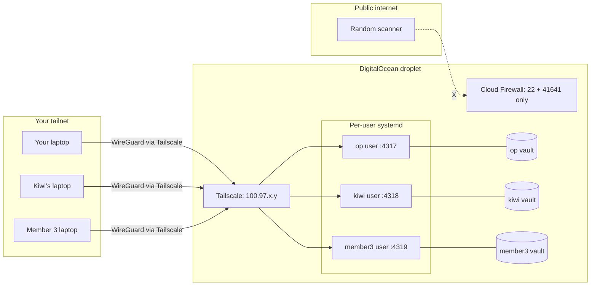
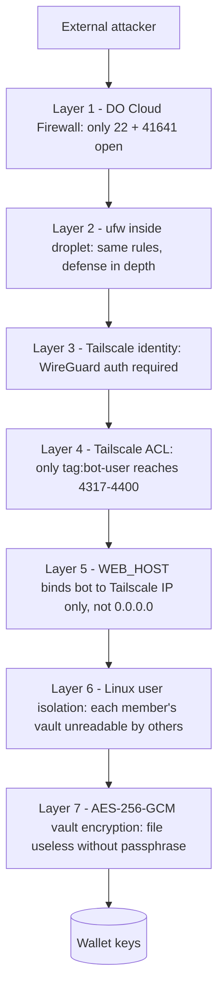

# VPS Deployment Plan - DigitalOcean + Tailscale + Per-User Instances

> **Status**: Draft for review. Not yet implemented.
> **Estimated total operator time**: ~90 minutes (after droplet exists)
> **Estimated per-member onboarding**: ~10 minutes

## Table of contents

1. [Goal](#goal)
2. [Architecture](#architecture)
3. [Security model](#security-model)
4. [Prerequisites](#prerequisites)
5. [Code changes required](#code-changes-required)
6. [New files to add](#new-files-to-add)
7. [Phase-by-phase execution](#phase-by-phase-execution)
8. [Hardening checklist](#hardening-checklist)
9. [Out of scope (v1)](#out-of-scope-v1)
10. [Definition of done](#definition-of-done)
11. [TODO list](#todo-list)

---

## Goal

Deploy the bot to a hardened DigitalOcean droplet so multiple team members can each run their own isolated copy. Access is gated by Tailscale - the public internet sees nothing except SSH and Tailscale UDP. Each member has their own Linux user, vault, port, and systemd service. No code-level multi-tenancy is needed; the isolation comes from the operating system.

---

## Architecture



**How a member uses it**: open a browser on their laptop, navigate to `http://100.97.x.y:43XX` where `XX` is their assigned port. Tailscale routes the traffic through the encrypted tunnel. The public internet sees nothing.

---

## Security model

The original bot was designed for "127.0.0.1 + no auth" - the localhost bind WAS the entire security boundary. Putting it on a VPS reverses that, so this section makes the new threat model explicit.

### What we trust

| Trust assumption | Why it's acceptable | If you want to remove it |
|---|---|---|
| DigitalOcean does not snapshot RAM of running droplets | Standard cloud-provider trust. Mitigated by Phase 8 wallet hygiene (each member uses a fresh wallet, never the treasury). | Self-host on bare metal, or use a confidential-computing instance (AWS Nitro / Azure DCsv3). |
| Tailscale Inc. does not abuse metadata access (they see "device A talked to device B at time T", never contents - WireGuard keys are client-side) | Tailscale is widely audited, used by Mullvad and many enterprises. Free for our scale. | Drop in Headscale (self-hosted control plane, drop-in compatible). 1-day setup. Listed as out of scope for v1. |
| Each team member secures their own laptop (no malware, screen unlocked only by them) | Standard team trust. Tailscale ACLs limit blast radius to dashboard ports only. 2FA on the OAuth provider gates new device enrollment. | Per-user audit logs (the bot doesn't have these yet - each member's actions still appear in their own systemd journal so you can attribute by user). |

### What's protected (the wins)

| Threat | Mitigated by |
|---|---|
| Random internet scanner finds the dashboard port | DigitalOcean Cloud Firewall (Phase 4) closes all ports except SSH + Tailscale UDP. Dashboard is invisible to the internet. |
| Brute-force login attacks | No login page exists on the public IP to attack. The dashboard has no auth because it has no public surface. |
| Wireshark / network sniffing on hotel Wi-Fi | All tailnet traffic is WireGuard end-to-end (Curve25519 + ChaCha20-Poly1305). |
| MITM via fake DNS / fake CA | Cryptographic per-device identity, not DNS-based. No CA chain to spoof. |
| DDOS against the dashboard | Public IP only exposes SSH + Tailscale UDP. Dashboard is invisible. |
| Compromised teammate's old or lost device still in tailnet | Tailscale admin panel - revoke device instantly. ACL further limits what `tag:bot-user` can reach (Phase 6). |
| RPC-key paste-into-wrong-browser leaks | Dashboard URL `100.x.y.z:4318` is meaningless outside the tailnet. Useless if pasted into a public site. |

### What's NOT protected (be aware)

| Gap | Why it's an acceptable v1 tradeoff | Future hardening |
|---|---|---|
| **Root compromise of the VPS** (e.g. Node CVE, supply-chain attack) means all vaults are forfeit | Same risk as any deployment. Mitigated by per-user wallet hygiene (Phase 8) - members fund only what's actively in play. | Hardware key signing (Ledger / Fireblocks) for txn approval. Major rewrite, not in scope. |
| **No "who started this strategy" audit log inside the bot** | Per-user systemd units mean per-user journald logs - you can attribute by Linux user. Good enough for a small trusted team. | Add an audit-log table to the SQLite store + per-action user-tag. ~1 day work, can ship later. |
| **Same-user actions (one member doing things to their own bot) have no second-factor** | Each member's vault is theirs - no horizontal access between members. | Hardware-key signing as above. |
| **VPS provider can read disk if they really want to** | Vault is AES-256-GCM encrypted at rest. Without the passphrase the file is mathematically useless. Passphrase is in `~/.amm-passphrase` (mode 0600) - readable by the VPS root user, not by other Linux users. | Move the passphrase to a hardware token / external KMS. ~3 days work. |

### Defense-in-depth layering



For an external attacker to reach a wallet key, **all 7 layers must fail**. For a tailnet-authenticated team member's compromised device to reach another member's keys, layers 4-7 must fail. For the VPS root user to reach a member's keys, layer 7 must fail (which requires the passphrase from `~/.amm-passphrase`, mode 0600 owned by that member's Linux user).

### Bottom line

This is **stronger** security than the bot's original "127.0.0.1, no auth" model:
- Originally: anyone with shell access to the host could reach `127.0.0.1:4317`
- Now: only authenticated tailnet members can reach the dashboard, and crypto identity is verified per-connection by Tailscale before the bot's network stack ever sees the request

The trust boundary moved from "this single laptop" to "any cryptographically-verified tailnet member" - wider, but still a closed boundary. Public internet sees nothing.

---

## Prerequisites

Set these up before any code changes:

- [ ] DigitalOcean account with billing enabled
- [ ] Tailscale account (free, sign up with Google or GitHub)
- [ ] List of team members and their preferred Linux usernames (e.g. `op`, `kiwi`, `alex`)
- [ ] Each member's SSH public key (so we can pre-install on the VPS)
- [ ] Each member ready to install Tailscale on their laptop

---

## Code changes required

The dashboard binds to localhost no matter what env you set. We need it to honor `WEB_HOST` so it can listen on the Tailscale interface. Edit the `dev` and `start` scripts in [apps/web/package.json](apps/web/package.json) (currently lines 6 and 8):

**Before:**
```json
"dev": "next dev -H 127.0.0.1 -p 4317",
"start": "next start -H 127.0.0.1 -p 4317"
```

**After:**
```json
"dev": "next dev -H ${WEB_HOST:-127.0.0.1} -p ${WEB_PORT:-4317}",
"start": "next start -H ${WEB_HOST:-127.0.0.1} -p ${WEB_PORT:-4317}"
```

Local default is unchanged (still 127.0.0.1) so `pnpm web` on your laptop keeps working. Only the VPS systemd unit will pass real values.

> **Why this matters**: without this fix, even if you set `WEB_HOST=100.97.x.y` in env, Next.js would still bind to `127.0.0.1` and tailnet members couldn't reach it.

This change must be committed and pushed FIRST so the VPS clones a working version.

---

## New files to add

| Path | Purpose |
|---|---|
| `deploy/digitalocean-bootstrap.sh` | One-shot root script - all hardening + Tailscale + Node + pnpm + git in ~3 minutes |
| `deploy/amm-bot@.service` | Systemd template unit, one instance per user (`amm-bot@kiwi.service`) |
| `deploy/add-bot-user.sh` | Operator script: creates Linux user, clones repo, picks port, sets up systemd unit |
| `deploy/setup-my-vault.sh` | Member script (placed in repo root): interactive vault init + wallet generate + backup |
| `deploy/tailscale-acl.json` | Copy-paste into Tailscale admin panel |
| `deploy/README.md` | Operator runbook (logs, monitoring, backups, member management) |
| `docs/vps-deployment.md` | ELI5 walkthrough for the operator (mirrors `docs/onboarding.md` style) |
| `docs/member-vps-onboarding.md` | What each team member does (Tailscale install, vault, fund, dashboard) |

---

## Phase-by-phase execution

### Phase 1: Push the package.json fix (5 min)

- Edit `apps/web/package.json` per the snippet above
- Run `pnpm --filter @amm/web build` to verify nothing breaks
- Commit with message `feat(web): honor WEB_HOST and WEB_PORT env vars for VPS deploys`
- Push to `origin/main`

### Phase 2: Create droplet (5 min)

In the DigitalOcean control panel - **Create Droplet**:

| Setting | Value |
|---|---|
| OS | Ubuntu 24.04 LTS x64 |
| Plan | Basic - Premium AMD - $14/mo (2 vCPU, 4 GB RAM, 80 GB SSD) |
| Why this size | Smaller works but RAM is tight when 3 Next.js processes are running. 4 GB gives headroom for 3-5 members. |
| Datacenter | NYC3 or AMS3 (closer to Solana RPCs = lower latency) |
| Authentication | SSH key (do NOT use root password) - paste your laptop's `~/.ssh/id_ed25519.pub` |
| Hostname | `amm-bot-1` |

Save the public IPv4 address it assigns. You'll use it once for the first SSH, then never again.

### Phase 3: First SSH + run bootstrap (10 min)

```bash
ssh root@<public_ip>
```

Paste the contents of `deploy/digitalocean-bootstrap.sh`. The script does, in order:

1. `apt update && apt full-upgrade -y`
2. Install: `curl ufw fail2ban unattended-upgrades build-essential python3 git`
3. Enable `unattended-upgrades` (auto security patches)
4. Configure `ufw`: deny incoming, allow `22/tcp`, allow `41641/udp`, enable
5. Configure `fail2ban` for SSH (10 fails -> 1h ban)
6. Disable root SSH password login (`PermitRootLogin prohibit-password`, `PasswordAuthentication no`)
7. Install Node 22 via NodeSource repo
8. `npm install -g pnpm@9`
9. Install Tailscale: `curl -fsSL https://tailscale.com/install.sh | sh`

### Phase 4: Configure DigitalOcean Cloud Firewall (5 min)

DigitalOcean control panel - **Networking - Firewalls - Create**:

**Inbound rules**:

| Type | Protocol | Port | Source |
|---|---|---|---|
| SSH | TCP | 22 | All IPv4 / IPv6 (we'll restrict via Tailscale ACL later) |
| Custom | UDP | 41641 | All IPv4 / IPv6 (Tailscale handshake) |

**Outbound**: All TCP/UDP (default).

Apply to droplet `amm-bot-1`. This is defense in depth - `ufw` inside the droplet does the same, both must agree.

### Phase 5: Bring up Tailscale (5 min)

Still SSH'd into the droplet:

```bash
tailscale up --ssh --advertise-tags=tag:botvps
```

- Open the printed URL on your laptop
- Log into Tailscale (use 2FA-protected account)
- Note the assigned 100.x.y.z IP: `tailscale ip -4`

Test from your laptop:

```bash
ssh root@100.x.y.z   # should work via Tailscale, no public-internet hop
```

**Optional max-lockdown**: now that Tailscale SSH works, you can close port 22 to the public:
- DO firewall: change SSH 22 source from "All" to "Your office IPv4 only"
- Or remove SSH 22 entirely if you trust Tailscale SSH (recommended)

### Phase 6: Apply Tailscale ACLs (5 min)

Tailscale admin panel - **Access Controls** - paste `deploy/tailscale-acl.json`:

```json
{
  "tagOwners": {
    "tag:botvps": ["autogroup:admin"],
    "tag:bot-user": ["autogroup:admin"]
  },
  "acls": [
    {
      "action": "accept",
      "src": ["tag:bot-user"],
      "dst": ["tag:botvps:4317-4400"]
    },
    {
      "action": "accept",
      "src": ["autogroup:admin"],
      "dst": ["tag:botvps:*"]
    }
  ]
}
```

Then in **Machines** - tag each member's device as `tag:bot-user`.

**Result**:
- Members CAN reach the dashboard ports (4317-4400)
- Members CANNOT reach SSH or any other port
- Only you (autogroup:admin) get full SSH

### Phase 7: Add team members as Linux users (5 min per member)

On the droplet, run for each member:

```bash
sudo bash deploy/add-bot-user.sh kiwi
```

The script:
- Creates user `kiwi` with home dir `/home/kiwi`
- Clones the repo to `/home/kiwi/MyMM`
- Picks the next free port (4317 for first user, 4318 for second, etc.) and writes it to `/home/kiwi/MyMM/.env.mainnet`
- Sets `WEB_HOST=$(tailscale ip -4)` in the env file
- Sets up systemd unit `amm-bot@kiwi.service` enabled but not started (waits for vault init)
- Pre-installs the member's SSH public key in `/home/kiwi/.ssh/authorized_keys`
- Prints: "Tell kiwi to SSH in via Tailscale and run `bash setup-my-vault.sh`"

### Phase 8: Each member's first-time setup (10 min per member)

Documented in detail in `docs/member-vps-onboarding.md`. Quick version:

1. Member installs Tailscale on their laptop, joins the tailnet, accepts operator invite
2. Member SSHs into VPS via Tailscale: `ssh kiwi@100.x.y.z`
3. Member runs `cd MyMM && bash setup-my-vault.sh` which interactively:
   - Prompts for a vault passphrase (asks twice, hidden input)
   - Runs `amm vault init`
   - Generates wallet `mainnet-1`
   - Prints the wallet pubkey
   - Prints the secret key for backup to Phantom (`amm wallet show`)
   - Reminds member to fund the wallet from Phantom
4. Member edits `~/MyMM/.env.mainnet` to fill in their RPC key (Helius URL)
5. Member writes the vault passphrase into `/home/kiwi/.amm-passphrase` (mode 0600)
6. Member starts the service: `systemctl --user start amm-bot` (requires `loginctl enable-linger kiwi` for boot-persistence)
7. Member opens browser to `http://100.x.y.z:4318` (port from setup script output)

### Phase 9: Operator monitoring (ongoing)

Documented in `deploy/README.md`:

| Task | Command |
|---|---|
| View all running bots | `systemctl list-units 'amm-bot@*.service'` |
| Tail logs for one user | `sudo journalctl -u amm-bot@kiwi.service -f` |
| Stop a misbehaving member's bot | `sudo systemctl stop amm-bot@kiwi.service` |
| Disk usage check | `du -sh /home/*/MyMM/.amm-mainnet/` |
| Backup all vaults nightly | cron + rsync to your laptop via Tailscale (vault is AES-256-GCM at rest already) |
| Add another member later | `sudo bash deploy/add-bot-user.sh <username>` (re-run Phase 7) |
| Remove a member | `sudo systemctl stop amm-bot@<user>.service && sudo userdel -r <user>` |

---

## Hardening checklist

The 7 hardening items from the planning conversation, mapped to which phase implements each:

| # | Item | Where in plan |
|---|---|---|
| 1 | DigitalOcean Cloud Firewall: only 22 + 41641 public | Phase 4 |
| 2 | SSH key-only, no passwords, fail2ban | Phase 3 (bootstrap script) |
| 3 | Bot binds to Tailscale interface, not 0.0.0.0 | Phase 1 (code fix) + Phase 7 (`WEB_HOST=$(tailscale ip -4)` in env file) |
| 4 | Tailscale ACLs limiting members to dashboard ports only | Phase 6 |
| 5 | 2FA on Tailscale OAuth provider (operator action) | One-line note in operator runbook |
| 6 | Per-user Linux accounts + isolated vaults + isolated systemd | Phases 7-8 |
| 7 | Wallet hygiene: fresh wallet per member, never the treasury | Phase 8 setup script + emphasised in member onboarding doc |

---

## Out of scope (v1)

Explicitly NOT doing in this iteration. Each could be added later if needed:

- **Self-hosted Headscale** (vanilla Tailscale fine for v1; can swap later if you want to remove Tailscale Inc. from trust chain)
- **HTTPS termination on the dashboard** (Tailscale traffic is already WireGuard-encrypted; HTTPS on top adds complexity for no security gain on a tailnet)
- **Audit log of "who started which strategy when"** (the bot has no auth/identity layer; per-user instances mean each member's actions show in their own systemd journal)
- **Automatic Phantom funding flow** (members do this manually one time)
- **Multi-region failover** (single droplet for v1)
- **Hardware-key transaction signing** (would protect against VPS root compromise; major rewrite)

---

## Definition of done

After execution you'll have:

- [ ] A reproducible bootstrap script anyone can re-run if the droplet dies
- [ ] A repeatable per-member onboarding (10 min from "send invite" to "running")
- [ ] Full audit trail via per-user systemd journals
- [ ] Zero public attack surface beyond SSH + Tailscale UDP
- [ ] Each member sees only their own vault, runs, and wallets
- [ ] Two new docs in `docs/`: operator walkthrough + member onboarding
- [ ] Operator runbook in `deploy/README.md`
- [ ] All scripts and unit files in `deploy/`
- [ ] Updated `README.md` linking to the new docs

---

## TODO list

In execution order. Each item maps to a single commit:

1. **code_fix_web_host** - Fix `apps/web/package.json` so `dev` + `start` honour `WEB_HOST` and `WEB_PORT` (defaults preserved). Build to verify. Commit + push.
2. **create_bootstrap_script** - Write `deploy/digitalocean-bootstrap.sh` (Phase 3 contents).
3. **create_systemd_unit** - Write `deploy/amm-bot@.service` template. Per-user `EnvironmentFile`, auto-restart, journald logging.
4. **create_add_user_script** - Write `deploy/add-bot-user.sh`. Picks next free port, clones repo, configures env file, enables systemd unit.
5. **create_setup_vault_script** - Write `deploy/setup-my-vault.sh` (in repo root so each member can run it). Interactive vault init, wallet generate, backup reminder.
6. **create_tailscale_acl** - Write `deploy/tailscale-acl.json`.
7. **create_operator_runbook** - Write `deploy/README.md` (operator-side: how to add member, view logs, stop bot, backup vaults, rotate ACLs).
8. **create_vps_deployment_doc** - Write `docs/vps-deployment.md` (full ELI5 operator walkthrough).
9. **create_member_onboarding_doc** - Write `docs/member-vps-onboarding.md` (member-side: install Tailscale, accept invite, SSH in, run setup, fund wallet, open dashboard).
10. **update_main_readme** - Add "VPS deployment" section to `README.md` linking to the two new docs.
11. **git_commit_push** - Final stage of all `deploy/` files + docs in clean commits, push to `origin/main`.

---

**To start execution**: tell me "go" or "execute". I'll work through the TODO list top to bottom, showing each change as I make it.
